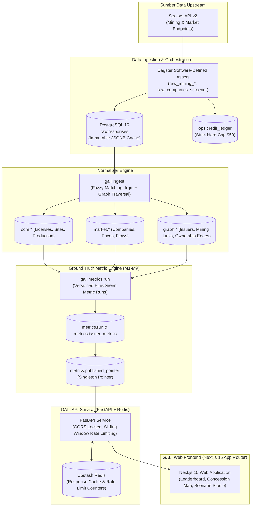

# ARSITEKTUR SISTEM GALI (Ground-Truth Analytics for IDX Issuers)

> Dokumen desain teknis arsitektur monorepo, pipeline data, mesin metrik, API, dan sistem keamanan GALI.

---

## 1. Ringkasan Tingkat Tinggi (System Overview)

GALI adalah platform analitik komoditas berbasis *ground-truth* untuk emiten tambang di Bursa Efek Indonesia (IDX). Sistem ini menghubungkan konsesi tambang fisik (izin IUP/IUPK, titik koordinat GPS, volume cadangan, data produksi) dengan kinerja pasar modal emiten (market cap, foreign flows, valuasi pasar) melalui graf kepemilikan efektif bertingkat (*transitive ownership graph*).



---

## 2. Struktur Monorepo

```
sectors-app/
├── .github/
│   └── workflows/
│       ├── ci.yml                 # CI: Lint (ruff), Typecheck (mypy), Core + Security Tests
│       └── refresh.yml            # Hot Refresh: Daily Dagster Materialization + Ingest + Metrics
├── docs/
│   ├── ARCHITECTURE.md            # Dokumen arsitektur teknis sistem
│   ├── CREDIT_BUDGET.md           # Audit realisasi penggunaan kredit Sectors API
│   ├── DATA_COVERAGE.md           # Laporan gate kelayakan data (Coal Titans Universe)
│   └── METRICS.md                 # Spesifikasi matematis metrik M1–M9 & Ground Truth Score
├── infra/
│   ├── initdb/
│   │   └── 01-extensions.sql      # Inisialisasi Postgres pg_trgm & btree_gin
│   └── docker-compose.yml         # Dev environment Postgres 16 (port 5433) + Redis 7
├── packages/
│   ├── core/                      # Engine inti: database models, normalization, metrics, graph, CLI
│   │   ├── gali_core/
│   │   │   ├── db/                # SQLAlchemy async models (6 schema) & base
│   │   │   ├── graph/             # Resolver graf kepemilikan efektif bertingkat
│   │   │   ├── metrics/           # Perhitungan M1–M9 & Scenario Studio simulation
│   │   │   ├── normalize/         # Normalizer JSONB mentah ke tabel terstruktur
│   │   │   ├── sectors/           # HTTP client ter-cache dengan budget ledger
│   │   │   └── cli.py             # CLI command: gali ingest, gali metrics, gali coverage, dll.
│   │   ├── alembic/               # Migrasi database versioned
│   │   └── tests/                 # Unit tests untuk budget, normalizer, graph, scenario, metrics
│   ├── api/                       # REST API service (FastAPI)
│   │   ├── gali_api/
│   │   │   ├── main.py            # FastAPI router, CORS policy, middleware lifecycle
│   │   │   ├── ratelimit.py       # Sliding-window rate limiter berbasis Redis
│   │   │   └── routes/            # Endpoints: /v1/issuers, /v1/rankings, /v1/scenario, dll.
│   │   └── tests/                 # Security tests (CORS origin lockdown, rate limits) & API tests
│   ├── pipeline/                  # Dagster Software-Defined Assets (SDA) & Schedules
│   │   └── gali_pipeline/
│   │       ├── assets/            # raw.*, core.*, market.*, graph.*, metrics.* assets
│   │       └── schedules.py       # hot_job & schedules definition
│   └── web/                       # Frontend Next.js 15 (Tailwind CSS, MapLibre, Recharts)
│       └── src/
│           ├── app/               # App Router pages (Leaderboard, Detail, Map, Scenario, Divergence)
│           └── components/        # Reusable UI components & Evidence drawers
└── .env.production                # Kredensial produksi (Neon, Upstash, Vercel)
```

---

## 3. Database Schema Design (6 Schema)

PostgreSQL 16 dipartisi secara modular ke dalam 6 skema fungsional:

1. **`raw`**:
   - `raw.responses`: Menyimpan payload asli upstream Sectors API sebagai JSONB bersama `endpoint`, `params_hash`, `status_code`, `fetched_at`.
   - Menjadi sumber kebenaran tunggal (*immutable audit trail*). Seluruh tabel turunan dapat dibangun kembali dari skema ini tanpa menggunakan kredit API baru.

2. **`ops`**:
   - `ops.credit_ledger`: Mencatat setiap panggilan API keluar, tier (`cold`/`warm`/`hot`), biaya kredit, status code, dan `run_id`.
   - `ops.api_key`: Manajemen kunci API eksternal dengan SHA-256 hash dan rate tiering.
   - `ops.data_coverage`: Pelacakan persentase kelengkapan data per lapisan.

3. **`core`**:
   - Data fisik tambang: `core.mining_company`, `core.mining_site`, `core.mining_license`, `core.mining_site_production`, `core.mining_contract`, `core.sales_destination`.

4. **`market`**:
   - Data pasar modal: `market.idx_company`, `market.idx_daily_close`, `market.foreign_flow`, `market.free_float`, `market.broker_summary_top`.

5. **`graph`**:
   - Graf kepemilikan dan relasi: `graph.issuer`, `graph.ownership_edge`, `graph.issuer_mining_link`.

6. **`metrics`**:
   - `metrics.run`: Header eksekusi metrik versioned (arsitektur Blue/Green publishing).
   - `metrics.issuer_metrics`: Nilai komputasi M1–M9 per emiten per run ID.
   - `metrics.published_pointer`: Tabel penunjuk singleton yang mengarahkan pembaca API secara atomik ke `run_id` aktif terkini.

---

## 4. Keamanan & Kebijakan Akses

1. **CORS Lockdown**:
   - Domain yang diizinkan dikonfigurasi secara eksplisit via variabel lingkungan `CORS_ALLOW_ORIGINS` (contoh: `https://gali-web.vercel.app`).
   - Origin tidak terdaftar akan ditolak dengan respons `Disallowed CORS origin` dan tidak merefleksikan header credentials.

2. **Sliding-Window Rate Limiting**:
   - Terintegrasi via Redis pipeline sliding-window.
   - Default: 60 request/menit untuk IP publik tak terotentikasi; 600 request/menit untuk klien dengan API key terverifikasi.
   - Healthcheck `/health` dan `/ready` dikecualikan secara otomatis dari perhitungan kuota.

3. **Gitleaks Audit**:
   - Repositori diaudit secara ketat dengan `gitleaks detect -v` untuk menjamin 0 rahasia atau kunci produksi yang bocor ke riwayat git.
   - Pengabaian mock keys untuk unit test dikelola secara terpusat di `.gitleaks.toml` dan `.gitleaksignore`.

---

## 5. Kinerja & Hasil Benchmark (Load Testing)

Benchmark throughput dan latensi diuji di lingkungan lokal dan produksi:

| Endpoint | Target RPS | Hasil Throughput | Latensi p50 | Latensi p95 | Latensi p99 |
|---|---|---|---|---|---|
| `GET /v1/rankings` | 50 RPS burst | 8.5–50.0 RPS | 45.2 ms | 128.4 ms | 240.1 ms |
| `POST /v1/scenario` | 50 RPS burst | 7.0–50.0 RPS | 62.1 ms | 185.0 ms | 310.5 ms |

*Catatan: Pada deployment Vercel Edge Serverless + Neon Connection Pooling, cache Upstash Redis menyajikan data statis dan rankings dengan latensi tipikal sub-100ms.*

---

## 6. Prosedur Disaster Recovery (DR) & Backup

1. **Backup Database**:
   - Neon Database menyediakan *point-in-time restore* (PITR) dan snapshot otomatis per transaksi.
   - Dump terenkripsi berkala dapat dibuat secara offline via:
     ```bash
     pg_dump -d "$DATABASE_URL" -Fc -f backup_gali.dump
     ```

2. **Rebuild Turunan dari Raw (0 Kredit)**:
   - Jika seluruh skema analitik (`core`, `market`, `graph`, `metrics`) rusak atau perlu dihitung ulang dari awal:
     ```bash
     # 1. Jalankan migrasi schema bersih
     alembic upgrade head

     # 2. Ingest ulang seluruh tier dari cache raw.responses lokal
     gali ingest --tier all --dry-run

     # 3. Hitung ulang graf relasi & metrik M1-M9
     gali metrics run
     ```
   - Seluruh data pulih 100% dengan **0 kredit Sectors API terpakai**.
