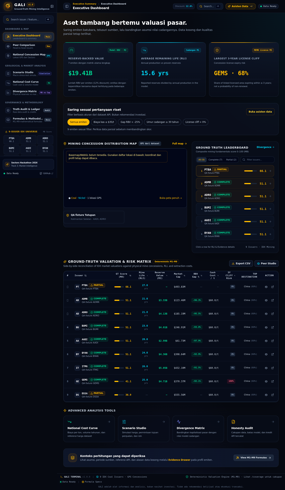
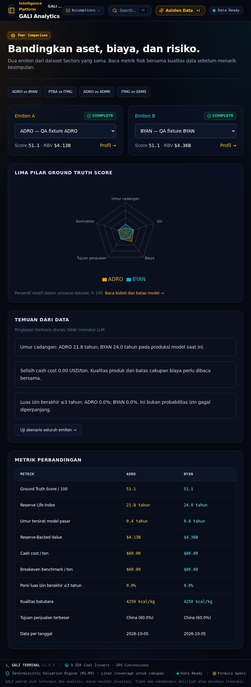
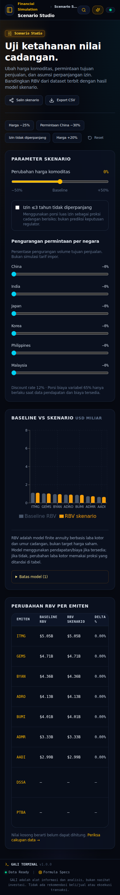
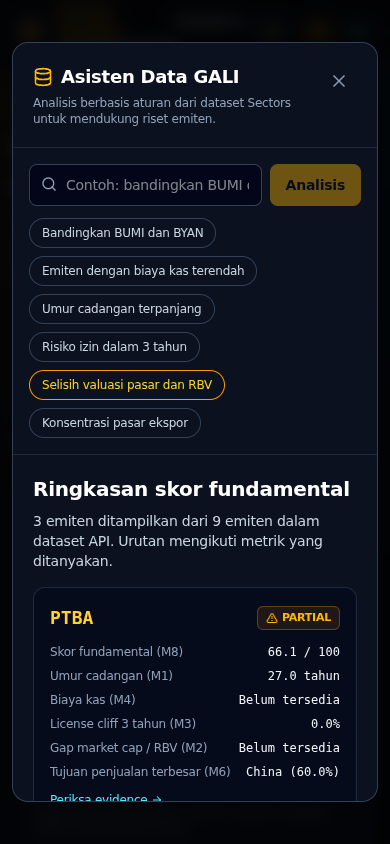

# GALI — Audit, Perbaikan, dan Kesiapan Demo

> Historical audit: the LLM findings below describe the implementation before GALI 0.5.0. The current release adds optional Gemini integration through Vertex AI. See [GEMINI_SETUP.md](GEMINI_SETUP.md) and [GEMINI_VERIFICATION.md](GEMINI_VERIFICATION.md) for the current implementation and its live-test boundary.

Tanggal pemeriksaan: **5 Oktober 2026**. Basis: ZIP repository yang diberikan, kode hasil perbaikan, aplikasi lokal dengan build produksi, dan aturan resmi yang diperiksa pada tanggal tersebut.

**Keputusan akhir: ALMOST DEMO READY — 8.0/10.** Alur utama bekerja pada dataset pengujian yang dinyatakan sintetis. Verifikasi deployment akhir, database native, Redis nyata, dan pengambilan data Sectors dengan kredensial tim masih diperlukan. Laporan ini tidak mengklaim aplikasi produksi sudah menerima perubahan ZIP.

## 1. Executive Summary

GALI memiliki fondasi produk yang kuat: menghubungkan emiten batubara IDX dengan cadangan, perusahaan operator, izin, biaya, tujuan penjualan, dan data pasar. Audit menemukan masalah yang lebih penting daripada kosmetik: simulasi memakai basis finansial yang keliru, persentase berubah skala di UI, data dari beberapa tahun digabung, chart memakai nama field yang salah, dan beberapa interaksi menyajikan angka atau analisis tiruan.

Perbaikan mengganti interaksi tiruan dengan fakta API, mengoreksi perhitungan dan periode, memperjelas data parsial, serta membuat error, ekspor, modal, navigasi, dan tampilan responsif konsisten. Perbaikan mempertahankan mesin analisis deterministik; tidak menambahkan klaim GenAI tanpa integrasi model yang nyata.

Hasil akhir yang benar-benar dijalankan:

| Pemeriksaan | Hasil | Makna / batas |
|---|---|---|
| Frontend TypeScript, ESLint, produksi Next.js | **Lulus** | Build melakukan pemeriksaan tipe dan lint; pengabaian error build dihapus |
| Ruff lint dan format | **Lulus, 96 file Python** | Seluruh repository Python yang masuk konfigurasi diperiksa |
| Mypy core | **Lulus, 36 file sumber** | Tidak mengklaim seluruh API/pipeline sudah mendapat cakupan mypy |
| Core + API | **93 lulus, 1 gagal dari 94** | Tes `test_tier_check_constraint` gagal pada rollback gateway PGlite; detail di bagian 5 |
| Pipeline resources | **4 lulus** | Mode offline dari environment dan override eksplisit terverifikasi |
| Dagster definitions | **Lulus validasi load** | Assets, jobs, schedules, resources dapat dimuat; bukan bukti ingest upstream selesai |
| Playwright Chromium | **9/9 lulus, 0 flaky, 0 skipped** | Alur utama dan 11 URL pada empat viewport; sekitar 103 detik |
| OpenAPI | **Dua snapshot cocok dengan schema runtime** | Tipe frontend diregenerasi dari schema API |
| Pemeriksaan secret ringan | **Tidak ditemukan pola key berkeyakinan tinggi pada 187 file teks** | Tidak ada `.env` non-template; bukan pemindaian histori Git atau sertifikasi keamanan |

Tidak ada P0 aplikasi yang diketahui dalam alur lokal yang diuji. Risiko P1 yang belum ditutup adalah kesiapan data nyata dan infrastruktur akhir, bukan error yang disembunyikan dengan data cadangan palsu. Basemap eksternal tidak berhasil dirender di lingkungan QA; daftar lokasi, koordinat, dan navigasi emiten tetap bekerja.

## 2. Product Understanding

| Aspek | Pemahaman produk |
|---|---|
| Problem | Data aset tambang, hubungan operator, keuangan, dan pasar tersebar. Ticker saja tidak menjelaskan umur cadangan, struktur biaya, atau masa berlaku izin. |
| Target User | Analis dan peneliti emiten batubara IDX yang membutuhkan konteks fundamental yang dapat diperiksa. |
| Core Solution | Pipeline mengubah respons Sectors menjadi graph hubungan entitas dan metrik turunan; UI menampilkan profil, perbandingan, biaya, skenario, serta cakupan. |
| Primary Value Proposition | Menelusuri hubungan aset fisik dan valuasi pasar dalam satu alur riset, dengan asumsi dan keterbatasan terlihat. Belum ada pengukuran waktu hemat yang sah untuk diklaim. |
| AI Value | Tidak ada LLM dalam implementasi akhir. Asisten Data mengklasifikasikan pertanyaan yang didukung dan merangkum fakta API memakai aturan. Tidak ada pemilihan model, token, prompt generatif, atau parsing keluaran model. |
| Key Differentiator | Perubahan asumsi harga/permintaan/izin dapat ditelusuri ke RBV, sambil mempertahankan alasan nilai kosong dan hubungan kepemilikan bersama. |

Alur teknis: Next.js/React → TanStack Query dan proxy `/api` → FastAPI → SQLAlchemy/PostgreSQL → published metric run → UI. Ingest server-side memakai Sectors REST, cache respons, normalisasi, graph ownership, dan mesin M1–M9. Dagster menyediakan orkestrasi. Redis mendukung cache dan rate limiter; limiter fail-open jika Redis tidak tersedia. Skenario menghitung hasil respons tanpa menyimpan portofolio pengguna. Tidak ada akun atau autentikasi pengguna dalam scope produk saat ini.

Interpretasi kesesuaian: GALI cocok untuk Track 3 karena RLI, RBV, skor, perbandingan, dan sensitivitas merupakan insight turunan. Track 3 memperbolehkan LLM opsional. Ini merupakan penilaian audit, bukan konfirmasi kelayakan peserta oleh panitia. Sumber: [Market Intelligence](https://hackathon.sectors.app/tracks/market-intelligence).

## 3. Feature Inventory

“Siap” di tabel berarti bekerja dalam QA lokal; tanda * memerlukan validasi dataset Sectors akhir.

| Feature | Priority | Status | Demo Ready? | Issues / Actions Taken |
|---|---|---|---|---|
| Landing dan orientasi produk | P0 | Berfungsi | Ya* | Value proposition dan dua CTA jelas; cuplikan emiten berasal dari API; menu tablet/mobile diperbaiki |
| Dashboard, filter, sorting, leaderboard | P0 | Berfungsi | Ya* | Nilai dinamis, jumlah complete/partial dari API, filter berbasis aturan, label metrik dikoreksi |
| Profil emiten | P0 | Berfungsi | Ya* | Data kosong tidak dijadikan nol; ringkasan dan diagram membaca field yang benar; unknown issuer memiliki state khusus |
| Evidence & Provenance | P0 | Berfungsi | Ya* | Konteks, asumsi, periode, alasan null, dan referensi API; klaim lineage penuh dihapus |
| Scenario Studio | P0 | Berfungsi | Ya* | Basis revenue/cost, persen, baseline, reset, izin 100%, cancel/debounce, URL dan CSV diperbaiki |
| Peer Comparison | P0 | Berfungsi | Ya* | Pilihan dari API, pasangan berbeda, URL persisten, radar lima pilar hanya saat lengkap |
| Coverage / ledger | P0 | Berfungsi | Ya* | Kelengkapan dan GPS dihitung, status readiness dipisahkan dari liveness |
| Asisten Data | P1 | Berfungsi sebagai aturan | Ya, dengan label yang ada | Respons API, prompt didukung, partial dan tautan profil; tidak boleh diperkenalkan sebagai LLM |
| Search command palette | P1 | Berfungsi | Ya* | Skor aktual, Ctrl+K, Escape, fokus; konflik dua modal ditutup |
| National Cost Curve | P1 | Berfungsi | Ya* | Tooltip tidak crash; sumbu volume numerik; benchmark hilang tetap null |
| Peta lokasi → emiten | P1 | Daftar/details berfungsi | Bersyarat | Banyak hubungan emiten dipertahankan; rendering basemap/WebGL belum tervalidasi sukses |
| Divergence / foreign-flow overlay | P1 | Berfungsi | Ya* | Hanya window 30 hari sampai as-of, percentile sesuai makna, partial tidak dipaksakan |
| Export CSV | P1 | Berfungsi | Ya* | Mengikuti hasil API dan parameter; BOM, quoting, null, dan proteksi formula |
| Sidebar dan navigasi mobile | P1 | Berfungsi | Ya | Collapse bertahan setelah refresh; empat viewport diuji |
| Methodology | P1 | Berfungsi | Ya | Rumus dirender dengan KaTeX; penjelasan basis dan batas model diperbarui |
| Sectors ingest / metric publication | P1 | Mesin lokal teruji | Bersyarat | Snapshot input, latest periods, quality gate, published pointer; ingest nyata dan orkestrasi penuh belum diuji |
| CI lint/build/backend/E2E | P1 | Konfigurasi diperbarui | Bersyarat | Tes API dan pipeline dimasukkan; GitHub Actions belum dijalankan pada remote |
| Print/browser sharing | P2 | Pendukung | Sebagian | Layout print dan clipboard ditangani; print fisik serta permission clipboard belum diuji lintas browser |
| Hot refresh otomatis | P2 | Default tidak diaktifkan | Tidak perlu untuk video | Memerlukan enable eksplisit dan guard freeze; bukan alur yang perlu ditonjolkan |
| GenAI, alert, akun, eksekusi perdagangan | P3 | Tidak diimplementasikan | Tidak | Bukan fitur yang dipresentasikan; tidak membuat tombol atau output palsu |

## 4. Issues Found and Fixed

Lokasi di bawah relatif terhadap root repository. Validasi “unit/API/E2E” merujuk hasil aktual di bagian 1; tidak menyatakan bahwa semua konfigurasi deployment sudah dijalankan.

| Issue / Severity | Location | Root Cause | Fix | Validation |
|---|---|---|---|---|
| Simulasi shock harga memakai laba kotor sebagai pendapatan — **P1** | `packages/core/gali_core/scenario/engine.py` | Revenue, cost, dan gross profit tercampur | Model memakai revenue/cost yang rekonsiliasi; fallback proksi diberi basis dan warning | Unit: R=100, C=60, GP=40; harga −25% → GP=15, delta RBV −62.5%; API dan E2E cocok |
| Delta skenario di UI/CSV salah faktor 100 — **P1** | `packages/web/app/scenario/page.tsx` | Field API sudah persen namun dikalikan ulang | Tampilkan/ekspor unit respons API apa adanya | E2E membandingkan layar dan isi CSV dengan respons API |
| Baseline berubah saat discount rate diubah — **P1** | Scenario engine / router | Baseline memakai parameter request | Baseline terbit terpisah dari asumsi skenario, input tersedia di snapshot | Unit discount rate dan API baseline; Reset E2E delta 0 |
| Seluruh cadangan berisiko izin tidak dapat menjadi nol — **P1** | Scenario engine | Guard mengharuskan umur pasca-shock positif | RLI nol diperbolehkan untuk shock izin penuh | Unit dan E2E preset GEMS → −100% pada fixture |
| Nilai finansial/RLI hilang disajikan sebagai 0 — **P1** | Scenario schema / engine / UI | Default numerik menutupi ketidaktersediaan | Nullable results, model basis, warnings, tanda “—” | Unit proxy; E2E PTBA/DSSA partial dan export disabled saat gagal |
| Beberapa tahun data dijumlahkan atau bergantung urutan — **P1** | `metrics/periods.py`, `metrics/engine.py`, scenario router | Tidak memilih latest reporting period secara konsisten | Pilih tahun terbaru per entitas; pertahankan semua baris tujuan/produk pada tahun itu | Unit pembalikan urutan, API fixture tahun lama + baru |
| Skenario membaca input baru untuk metrik lama — **P1** | Metric engine / scenario router | Published run dan tabel input bergerak terpisah | Simpan input skenario relevan dalam published snapshot; jalur kompatibilitas tetap eksplisit | API baseline dan ownership/financial fixture |
| Banyak owner/issuer dari lokasi yang sama hilang — **P1** | Scenario / sites routers | Memilih satu simbol atau satu operator | Ownership teratribusi; lokasi menampilkan seluruh simbol terkait, primary deterministik | API ADRO/AADI dan E2E lokasi → AADI |
| Window “30 hari” memasukkan histori lebih lama — **P1** | `routers/flow_overlay.py`, metric engine | Penjumlahan histori tanpa batas tanggal lengkap | Filter as-of minus 30 hari hingga as-of; peringkat/quadrant diperbaiki | API fixture arus lama sangat besar tidak masuk hasil |
| Benchmark fiktif muncul saat data harga kosong — **P1** | Cash cost / quality / cost-curve API/UI | Default harga 100, 102.87, atau 85 dianggap aktual | Tidak mengisi harga acuan yang hilang; label Coal generik dan tanggal sumber | Unit missing benchmark, API dan E2E chart |
| Izin berconfidence rendah, area/tanggal hilang dianggap aman — **P1** | `metrics/license_cliff.py` | `confidence or 1` meloloskan nol; area default dan unknown risk | Filter confidence eksplisit, null dan alasan jika input tidak memadai | Unit license confidence, missing area/date |
| Expiry kontrak hilang menjadi risk nol — **P1** | `metrics/contracts.py`, `metrics/score.py`, engine | Missing date masuk denominator tanpa penalti; HHI/expiry diimputasi | Null jika identitas/tanggal tak lengkap; pilar kontraktor hanya dihitung saat kedua input tersedia | Lima regression cases, termasuk datetime dan dropped weight |
| Publikasi kosong dan pointer cache usang — **P1** | Metric engine / API dependencies | Publication gate dan TTL pointer tidak cukup ketat | Tolak hasil tanpa issuer/RBV usable; pointer terbaru dibaca dari database | Tes core/API dan fixture melalui pipeline publikasi nyata |
| Evidence memilih ID raw yang tidak relevan — **P1** | `metrics/engine.py`, `metrics/evidence.py` | Daftar respons umum dipakai sebagai lineage | Referensi endpoint/query/entitas relevan; source years dan scope; audit konteks 3.0 | API assertions dan E2E drawer; batas lineage ditulis jelas |
| Tampilan AI berisi rekomendasi/hardcoded output — **P1** | Asisten lama, dashboard, compare | UI mengesankan keluaran model tanpa integrasi | Hapus copilot palsu; Asisten Data mengambil fakta API dan memakai aturan transparan | E2E prompt ADRO/BYAN; label “berbasis aturan”; scan output investasi |
| Skor/ticker navigasi dan landing hardcoded — **P1** | Sidebar / CommandPalette / landing | Angka demo tidak terikat dataset | Gunakan list issuer API dan jumlah partial/complete aktual | E2E skor pencarian dibandingkan respons API |
| Pilar radar memakai nama field salah — **P1** | `lib/scores.ts`, compare / issuer | Key UI tidak sama dengan backend | Lima key kanonik; radar hanya bila seluruh pilar ada; partial memakai grid | E2E 2 radar untuk pasangan lengkap, 0 radar saat partial |
| Cost-curve tooltip dapat crash — **P0** | `app/cost-curve/page.tsx` | Memanggil `toFixed` pada `production_mt` yang tidak ada | Pakai `annual_volume_mt`, guard null, numeric volume axis | Hover tooltip E2E; tidak ada pageerror |
| Request gagal/terlambat menghasilkan layar lemah — **P1** | `lib/api.ts`, DataState, pages | Error mentah, timeout/cancel tidak konsisten | Timeout 20 detik, error ramah, retry, empty states, null guard | E2E 503/dashboard/scenario, empty issuer list, unknown issuer |
| Hasil skenario lama tampak berlaku untuk kontrol baru — **P1** | Scenario UI | Request tumpang tindih dan hasil stale tetap terlihat | Debounce 350 ms, cancel signal, query key parameter, nonaktifkan hasil/ekspor selama perubahan | E2E preset/reset/refresh/CSV; typecheck |
| Refresh menghapus pasangan/skenario — **P1** | Scenario / compare pages | State hanya berada di komponen | URL memuat parameter yang dibatasi; pasangan sama diselesaikan | E2E refresh dan distinct-pair |
| CSV rapuh dan isi tidak sesuai layar — **P1** | `lib/export.ts`, dashboard / scenario | Escaping dan unit tidak seragam | Helper CSV, BOM, quoting, formula guard, ekspor respons aktual dan asumsi | Download CSV E2E; typecheck |
| API key palsu dapat membeli quota/bucket baru — **P1** | `gali_api/ratelimit.py`, config | Header key tidak diverifikasi tetapi diberi tier keyed | Quota publik per IP; forwarded headers hanya bila trusted proxy dikonfigurasi | Tes security untuk forged key, spoofed proxy dan 429 |
| “Live” dianggap sama dengan siap data — **P1** | AppShell / Header / Sidebar | Memeriksa liveness saja | Poll `/ready`, status Data Ready; tidak menyembunyikan database/published-run requirement | API readiness dan browser route checks |
| Mode offline pipeline mengabaikan environment — **P1** | `gali_pipeline/resources.py` | Default `False` mengoverride `GALI_DRY_RUN=1` | Default None mengikuti settings, override hanya bila eksplisit | Empat tes parameter dan Dagster validation |
| Docker Compose merujuk Dockerfile yang hilang — **P1** | `infra/Dockerfile.pipeline` | Image pipeline belum disediakan | Tambahkan image dan entrypoint Dagster sesuai konfigurasi Compose | Dependency install, CLI help, definitions load; Docker build masih belum diuji |
| Modal ganda / keyboard / fokus tidak konsisten — **P1** | AppShell, CommandPalette, EvidenceDrawer, `useDialog` | Toggle shortcut dan lifecycle tersebar | Search/asisten eksklusif, trap fokus, Escape, restore, body scroll lock, tutup saat route berubah | E2E Ctrl+K/Ctrl+J/Escape dan modal mobile; audit sumber focus hook |
| Basemap/WebGL gagal membuat alur peta buntu — **P1** | MiningSitesMap | Hanya canvas eksternal menjadi jalur interaksi | Warning eksplisit, daftar API, selection, koordinat, multi-issuer links, cleanup event | E2E fallback daftar → lokasi → profil; happy-path basemap belum berhasil |
| Tablet landing meluber dan heading tidak tepat — **P1/P2** | LandingNavbar, Header, dashboard | Navbar penuh pada breakpoint md; judul halaman hanya di header | Drawer di bawah lg, CTA ringkas, main h1 dashboard, overflow rumus dibatasi | Ke-11 URL tidak meluber pada 1440/1280/768/390 px |
| Copy/label/provenance berlebihan — **P2** | Dashboard, map, Header, ConfidenceBadge, docs | Klaim “100% provenance”, live benchmark, mislabeled M6/M1, istilah aman/undervalued | Konteks perhitungan, M2 RBV, GPS label, available weight, assumption-only price copy | Pemeriksaan source dan screenshot; build |
| Build meloloskan kesalahan dan lint script usang — **P0/P1** | Next config / package scripts / CI | Ignore-build-errors dan command tidak cocok versi | Strict build, ESLint langsung, schema regeneration, API + pipeline + E2E jobs | Typecheck/lint/build lokal lulus; CI remote belum dijalankan |
| Dokumentasi/demo menyiratkan fitur yang tidak ada — **P1/P2** | README, METRICS, JUDGING_SCRIPT | Run commands, live AI, raw evidence, dan performa tidak didukung bukti | Quickstart akurat, explicit QA fixtures, batas model dan script berbasis layar aktual | Doc/source cross-check, build methodology |
| UI dan eksperimen mati berulang — **P2/P3** | Web components | Dua navigasi/copilot dan dekorasi tanpa penggunaan | Hapus AiCopilotModal, floating copilot, Navbar, AssumptionBar, Marquee, RetroGrid, SpotlightCard | Reference search, lint/typecheck/build; alur terkait E2E |

Hardcoded values yang dipertahankan memiliki tujuan jelas: universe ticker adalah scope produk; bobot skor, discount 12%, variable cost 65%, dan preset shock adalah asumsi model yang diberi label. `setTimeout` dipakai untuk debounce kontrol dan animasi nilai aktual, bukan meniru generasi AI. Golden fixtures dan seed QA adalah **DEMO DATA untuk tes yang eksplisit**, bukan fallback UI ketika API gagal.

## 5. Remaining Issues

### P0

**Tidak ada P0 aplikasi yang diketahui pada alur lokal yang diuji.** Deployment final belum cukup diperiksa untuk membuat pernyataan yang sama tentang lingkungan produksi.

### P1

1. **Dataset Sectors akhir dan deployment:** ZIP tidak menyertakan credential atau cache lengkap. Jalankan smoke test dengan dataset tim yang sah: `/ready`, Coverage, profil lengkap/parsial, baseline skenario, CSV, dan metadata periode. Pemeriksaan read-only URL produksi sebelumnya menunjukkan health/list tersedia; itu bukan bukti kode baru telah dipasang atau rumus baru telah dipublikasikan.
2. **PostgreSQL native dan Redis:** QA memakai PGlite/PostgreSQL WASM melalui socket gateway, dengan driver psycopg dan prepared statements dimatikan hanya di harness scratch. Tes constraint gagal pada `ROLLBACK` dengan `received 0 results from command 'ROLLBACK'`. Run sebelumnya sempat lulus; run final 93/94. Ini konsisten dengan keterbatasan gateway dan tidak boleh dinyatakan sebagai kelulusan native Postgres. Tes tidak dihapus atau dilemahkan. Jalankan suite lengkap di PostgreSQL 16 + Redis 7 melalui CI/Compose; investigasi lebih lanjut jika kegagalan tetap muncul di sana.
3. **Basemap/WebGL:** Endpoint lokasi, daftar, detail dan tautan profil lulus. Tile OpenFreeMap/WebGL tidak berhasil tampil dalam QA. Lakukan cek pada browser perekaman dan jaringan nyata. Jika gagal, demo daftar lokasi tetap sah tetapi jangan menjanjikan interaksi canvas yang belum diverifikasi.
4. **Ingest dan batas kredit nyata:** Sectors client/cache/budget tests serta publication engine lokal diuji, tetapi ingest seluruh universe, pagination aktual, Dagster materialization menyeluruh dan kredensial upstream belum dijalankan. Dataset campuran atau stale tetap harus diperiksa melalui as-of/source years.
5. **Status kompetisi:** Registration/onboarding, asal dan histori repository, status submission/freeze, serta materi submission tidak dapat dibuktikan dari ZIP. Jangan menerapkan perubahan bila proyek sudah dibekukan. Guard workflow baru tidak otomatis menghentikan scheduler yang sudah aktif pada deployment lama.

### P2

- Bahasa Indonesia/Inggris masih bercampur pada beberapa label; dapat diseragamkan setelah data/infrastruktur lolos.
- Tabel luas dan halaman mobile panjang memakai scroll; empat viewport tidak meluber, tetapi pengujian Safari/iOS/Firefox dan screen reader penuh belum dilakukan.
- Accessibility diperbaiki melalui label, heading, fokus, Escape, dan reduced motion; belum ada sertifikasi WCAG atau audit kontras menyeluruh.
- Viewport peta tetap menyisakan ruang luas saat basemap gagal. Fallback mencegah buntu tetapi bukan pengganti pengalaman spasial yang utuh.
- Evidence adalah konteks dan referensi relevan, **belum raw payload viewer atau lineage input-per-kolom**. Implementasi sudah berhenti menjanjikan keduanya.
- Validitas domain RBV, asumsi biaya variabel, benchmark kualitas dan area izin sebagai proksi cadangan masih membutuhkan review analis. Rumus lolos regresi bukan bukti model layak memprediksi harga saham.
- README historical coverage dan dokumen fase lama perlu diperlakukan sebagai catatan waktu, bukan kondisi dataset sekarang; Coverage dinamis adalah rujukan operasional.
- CI dan image Docker baru belum dijalankan di GitHub/Docker native; konfigurasi dan dependency/entrypoint telah diperiksa.

### P3

- Pecah dashboard besar menjadi bagian data/table/map untuk maintainability setelah demo stabil.
- Tambahkan per-field lineage dan histori dataset/model apabila produk dikembangkan lebih lanjut.
- Pertimbangkan LLM hanya jika ada kebutuhan pengguna, provider, credential, schema output, ground-truth references, timeout dan evaluasi yang jelas. Saat ini tidak ada integrasi tersebut.
- Tambahkan performance budgets dan tes lintas browser; akun/workspace/alert bukan kebutuhan demo inti saat ini.

## 6. UI/UX Review

| Area | Penilaian akhir |
|---|---|
| Design consistency | Tema gelap, amber untuk aksi, cyan/emerald untuk metrik, card/border/type konsisten. Sistem font menghindari ketergantungan fetch font saat build. |
| Navigation | Landing memberi jalan ke dashboard/skenario. Sidebar memiliki rute utama, collapse persisten, drawer mobile; search dan link balik profil teruji. Footer diarahkan ke rute nyata. |
| Information hierarchy | Problem/CTA terlebih dahulu; metrik → filter → lokasi/leaderboard → matriks → alat lanjut. Scenario memisahkan parameter, hasil, dan batas model. |
| Redundancy | Copilot/floating button/navigasi duplikat dihapus. Asisten global memiliki satu jalur. Nama modul pada shell dan headline isi membantu orientasi, dengan satu main h1. |
| Loading states | Skeleton/status fetch tersedia. Scenario menyembunyikan hasil stale dan menonaktifkan ekspor saat query belum sesuai parameter. |
| Empty states | Issuer list kosong, GPS tak lengkap, pencarian nihil, metric null dan unknown ticker memiliki pesan serta tindakan yang sesuai. |
| Error states | API 503, network/timeout, validation, 404, rate limit ditranslasikan; retry tersedia. Tidak ada injeksi nilai palsu sebagai sukses. |
| Responsiveness | Sebelas URL diuji pada desktop 1440×900, laptop 1280×800, tablet 768×1024, mobile 390×844. Tidak ada overflow dokumen pada snapshot yang diuji. Tabel tertentu sengaja dapat di-scroll di dalam container. |
| Interaction quality | Shortcut, Escape, retry, scenario reset/preset, pair selection, CSV download, refresh, peta daftar/detail teruji. Fokus trap dan restore diimplementasikan; permission clipboard ditangani sesuai hasil operasi. |

Screenshot di `docs/qa/` adalah **QA fixture sintetis**. Angka di dalamnya bukan fakta pasar atau hasil pengambilan Sectors live.

## 7. Code Health

- **Dead code:** tujuh komponen lama/eksperimen dihapus; komponen NumberTicker dan BorderBeam dipertahankan karena benar-benar digunakan.
- **Duplicate logic:** CSV, error/empty UI, score keys, latest-period selection, dan dialog lifecycle mendapat helper bersama.
- **Technical debt:** dashboard masih besar; code/data version dalam run bukan pengganti commit fingerprint; graph entity-match tetap perlu audit terhadap data baru.
- **Runtime risks:** network upstream/tiles, Redis fail-open, proxy trust, stale dataset, dan input finansial parsial disampaikan secara eksplisit. Cleanup listener dan cancel request mengurangi race dan leak.
- **Data consistency:** backend schema → OpenAPI → TypeScript memakai field/unit yang sama; data bernilai nol dibedakan dari null. Kepemilikan bersama tetap dapat menyebabkan penjumlahan RBV antar-emiten menghitung ulang aset yang sama; dashboard memberi keterangan.
- **Security:** tidak ada credential ditambahkan. Sectors key tetap server-side; API publik hanya membaca/menghitung. Arbitrary API key tidak diberi hak tambahan. Trusted proxy harus menimpa header. Secret scan tidak mencakup Git history karena ZIP tidak memiliki histori Git.
- **Build/lint/test status:** lihat tabel bagian 1. Seluruh tes browser lulus; satu tes database gagal di gateway dan tetap tercatat. Tidak ada klaim “semua tes hijau” atau “production certified”.
- **Performance:** output build menunjukkan shared First Load JS sekitar 102 kB, landing 119 kB, dashboard 421 kB, map 391 kB, scenario 234 kB, compare 233 kB. Ini ukuran bundle build, bukan pengukuran load time, p95 API, atau Lighthouse. Map/chart mendominasi; belum ada load test realistis yang dijalankan dalam audit ini.

Perintah verifikasi portable terdapat di README. Harness PGlite/Chromium khusus lingkungan QA tidak ditambahkan sebagai runtime produk. Fixture test mempunyai guard `ENVIRONMENT=test` dan `GALI_QA_FIXTURES=1`, menolak published dataset non-QA, dan menandai nama/data_version sebagai QA. Jangan menggunakan seed pada database demo Sectors atau produksi.

## 8. Demo Flow

Tujuan: satu cerita riset yang selesai dalam tiga menit. Gunakan angka yang terlihat pada dataset Sectors akhir, bukan menghafal angka fixture. Naskah terpisah tersedia di `docs/JUDGING_SCRIPT.md`.

| Waktu / Screen | Action | What presenter says | Expected result / Key message | Risk dan mitigasi |
|---|---|---|---|---|
| 0:00–0:20 / Landing | Klik **Mulai analisis** | “Ticker tidak menjelaskan kapan cadangan habis atau izin berakhir. GALI menghubungkan data aset dan pasar untuk riset.” | Problem, pengguna dan solusi dipahami sebelum chart | Mulai pada browser 100%, tab siap, `/ready` dicek |
| 0:20–0:50 / Dashboard → issuer | Filter lengkap, buka emiten dengan input lengkap | “Kita membaca umur cadangan, biaya, nilai model dan kualitas data bersama.” | Satu objek tetap konsisten dari daftar ke profil | Pilih emiten sesuai Coverage aktual; jangan mengklaim harga target |
| 0:50–1:15 / Evidence | Buka **Evidence & Provenance**, tutup Escape | “Asumsi dan periode sumber terlihat; data yang tidak tersedia memiliki alasan.” | Penonton melihat transparansi, bukan angka tanpa konteks | Jangan menyebut drawer raw payload/per-field lineage penuh |
| 1:15–1:45 / Compare | Pilih dua emiten lengkap; opsional switch partial | “Lima pilar membandingkan karakteristik aset. Pilar yang hilang tidak diisi nol.” | Radar atau grid sesuai kelengkapan; URL mempertahankan pilihan | Partial switch dilakukan bila waktu cukup; bukan rekomendasi pemenang |
| 1:45–2:20 / Scenario | **Harga −25%**, lihat delta, **Reset** | “Mengubah harga memengaruhi pendapatan dan laba model. Reset kembali ke baseline.” | **Wow moment:** kontrol → hitungan API → perubahan RBV → baseline nol | Tunggu loading selesai; baca basis revenue/cost atau proxy yang tertera |
| 2:20–2:40 / Asisten | Ctrl+J, “bandingkan BUMI dan BYAN” | “Asisten ini merangkum fakta yang tersedia dengan aturan yang transparan.” | Fakta kedua emiten dan tautan untuk memeriksa sumber | Jangan menyebut GenAI; gunakan pertanyaan yang didukung |
| 2:40–3:00 / Coverage | Tunjukkan complete/partial/GPS/ledger | “Riset lebih mudah diperiksa, termasuk batas data dan modelnya.” | Penutup menunjukkan kegunaan dan kejujuran data | Angka ledger diambil saat rekaman; tidak mengklaim penghematan yang belum diukur |

Peta → lokasi → profil adalah alur pendukung atau alternatif bila data GPS dan basemap siap. Jika tile gagal, gunakan daftar, bukan berpura-pura canvas berhasil. Teaser satu menit: problem/landing 15 detik, dashboard/profil 15 detik, skenario/reset 20 detik, Evidence/Coverage 10 detik. Rekam produk yang bekerja; tidak perlu menjadikan semua menu bagian video.

## 9. Demo Risk Checklist

**Sudah diperiksa dalam audit lokal:**

- [x] Build produksi, TypeScript, ESLint, Ruff, mypy core.
- [x] Migrasi schema dan published test dataset melalui mesin metrik.
- [x] API utama dan skenario pada fixture lengkap/parsial.
- [x] Landing → dashboard → profil → Evidence.
- [x] Compare, preset/reset, URL refresh dan isi CSV mengikuti API.
- [x] Search/asisten, sidebar persisten, navigasi mobile, Escape.
- [x] API gagal, dataset kosong, unknown issuer, export disabled saat gagal.
- [x] Tidak ada pageerror yang membuat alur gagal pada tes browser yang memantau error.
- [x] Sebelas URL pada empat viewport, tanpa overflow dokumen.
- [x] Tidak ada copilot palsu, skor hardcoded, atau harga acuan fiktif di alur utama.
- [x] Pipeline offline-mode regression dan definitions load.

**Masih harus diperiksa dengan environment akhir:**

- [ ] PostgreSQL 16 + Redis 7: suite core/API/pipeline penuh, termasuk constraint rollback.
- [ ] Sectors key server-side tersedia; kredit cukup; dataset nyata terpublikasi dan Coverage diperiksa.
- [ ] Build/deployment akhir menunjuk API yang benar; `/ready` sukses dan tidak hanya `/health`.
- [ ] Pipeline live/cached, ownership, source years dan model basis sesuai dataset final.
- [ ] Basemap/WebGL di browser perekaman; siapkan alur daftar lokasi bila diperlukan.
- [ ] Ulang smoke profil/compare/scenario/CSV dengan data aktual setelah rebuild/recompute.
- [ ] Browser zoom 100%, viewport video, clipboard permission, dan tidak ada log error kritis.
- [ ] Snapshot/rekaman tidak memuat nama “QA fixture” sebagai data Sectors nyata.
- [ ] GenAI API: **tidak berlaku**; presenter menyebut asisten berbasis aturan.
- [ ] Authentication/demo account: **tidak berlaku**; produk publik tanpa login. Akun Sectors tim hanya untuk data server-side.

**Ketentuan submission resmi yang belum dapat diverifikasi dari ZIP:**

Registrasi ditutup **7 Oktober 2026 23:59 WIB**; submission **8 Oktober 2026 23:59 WIB**. Lengkapi onboarding anggota dan verifikasi asal/histori repository. Sediakan repository publik selama sedikitnya 90 hari setelah pengumuman, teaser publik satu menit, judging video maksimal tiga menit, problem statement satu kalimat, track dan nama peserta, serta post Instagram/LinkedIn/Threads/TikTok bertag akun resmi dengan thumbnail yang disediakan. Judging asinkron; deployment live tidak wajib. Freeze berlaku sejak submission atau deadline, mana yang lebih awal: hentikan perubahan dan scheduler. Sumber: [Official Rules](https://hackathon.sectors.app/rules).

## 10. Final Score

Skor merupakan penilaian audit terhadap hasil yang terverifikasi dan batas yang tersisa, bukan prediksi skor juri. Overall adalah penilaian holistik terhadap demo Market Intelligence, bukan rata-rata aritmetika yang mewajibkan LLM.

| Category | Score /10 | Mengapa belum 9 |
|---|---:|---|
| Technical Stability | **8.4** | Build dan mayoritas suite lulus; constraint gateway, native Postgres/Redis, Docker dan deployment final belum tervalidasi penuh |
| UI Consistency | **8.5** | Konsistensi layout/modal meningkat; label bilingual dan beberapa komponen besar masih tersisa |
| UX Clarity | **8.5** | Alur jelas, state jujur; istilah finansial dan asumsi masih memerlukan orientasi pengguna baru |
| Visual Polish | **8.3** | Empat viewport teruji dan diperiksa; fallback map menyisakan area kosong, tabel mobile panjang, lintas browser belum diuji |
| AI Capability | **2.0** | Tidak ada LLM/GenAI; asisten aturan berguna tetapi tidak memenuhi klaim kemampuan generatif |
| Hackathon Alignment | **8.4** | Insight turunan dan Sectors sebagai sumber inti cocok Track 3; onboarding, histori, freeze dan materi belum terverifikasi |
| Demo Reliability | **7.8** | Local E2E stabil; upstream, basemap dan deployment akhir masih risiko yang harus ditutup |
| Product Storytelling | **8.4** | Problem, Evidence, skenario/reset dan Coverage membentuk cerita; video akhir dan pemahaman pengguna belum diuji |
| Performance | **7.5** | Debounce/cancel/cache membantu; dashboard/map bundle relatif besar, belum ada pengukuran p95 atau device lambat |
| **Overall Demo Readiness** | **8.0** | **ALMOST DEMO READY**: perbaikan sumber dan QA lokal selesai; validasi data/infrastruktur akhir dan submission tetap diperlukan |

Status dapat dinaikkan menjadi **DEMO READY** setelah checklist environment akhir lolos, satu tes database dijalankan bersih di PostgreSQL native, dan walkthrough direkam dengan dataset Sectors nyata. Tidak perlu menambah fitur P3 untuk mencapai itu.
